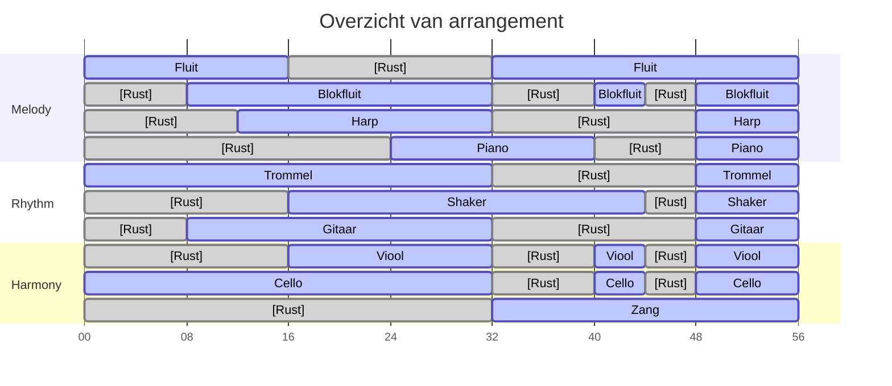

# Arrangement van The Mountain door Gorillaz

Hoi allemaal,

Zo'n beetje elk jaar komen we bij elkaar om ingestudeerde muziekstukken aan elkaar voor te dragen.
Dit keer leek het me leuk als we samen een muziekstuk oefenen.
Iedereen hoef slechts 8 maten te leren. Deze 8 maten worden op verschillende momenten in het stuk herhaalt.

Ik heb een arrangement geschreven van [The Mountain door Gorillaz](https://youtu.be/a2IdAW2A1ug?si=ESMKC07APd6FcPqz) voor de (dwars)fluit, blokfluit, harp, piano, trommel, shaker, gitaar, viool, cello en zang. Dus iedereen kan meedoen. Hieronder is een overzicht van hoe de 8 maten per instrument zich herhalen en overlappen met elkaar:

Hier zien we dat de fluit, trommel en cello samen beginnen. Vervolgens springen de blokfluit en gitaar bij. Daarna de harp, enzovoort.

Hieronder vind je de pagina's naar de bladmuziek van zowel het volledige arrangement als voor individuele instrumenten en groepjes van instrumenten:

- [Het volledige arrangement](arrangement)
- [fluit](fluit)

Op elke pagina kan je de bladmuziek downloaded. Ook vind je een opname van hoe het ongeveer klinkt. De opnames zijn met computer gemaakt. In het echt klinkt het vast veel mooier.
