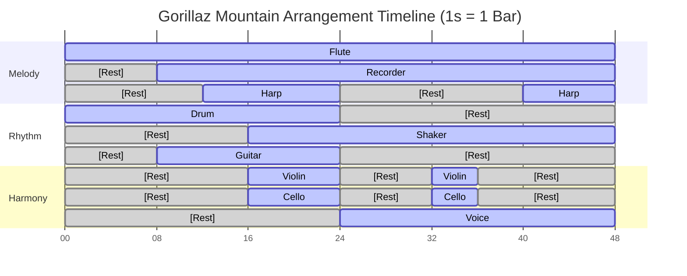

# Notes

```mermaid
---
displayMode: compact
---
gantt
    title Gorillaz Mountain Arrangement Timeline (1s = 1 Bar)
    dateFormat mm:ss
    axisFormat %S
    tickInterval 8second

    section Melody
    Flute               :active, 00:00, 00:48

    [Rest]              :done,   00:00, 00:08
    Recorder            :active, 00:08, 00:48

    [Rest]              :done,   00:00, 00:12
    Harp                :active, 00:12, 00:24
    [Rest]              :done,   00:24, 00:40
    Harp                :active, 00:40, 00:48

    section Rhythm
    Drum                :active, 00:00, 00:24
    [Rest]              :done,   00:24, 00:48

    [Rest]              :done,   00:00, 00:16
    Shaker              :active, 00:16, 00:48

    [Rest]              :done,   00:00, 00:08
    Guitar              :active, 00:08, 00:24
    [Rest]              :done,   00:24, 00:48

    section Harmony
    [Rest]              :done,   00:00, 00:16
    Violin              :active, 00:16, 00:24
    [Rest]              :done,   00:24, 00:32
    Violin              :active, 00:32, 00:36
    [Rest]              :done,   00:36, 00:48

    [Rest]              :done,   00:00, 00:16
    Cello               :active, 00:16, 00:24
    [Rest]              :done,   00:24, 00:32
    Cello               :active, 00:32, 00:36
    [Rest]              :done,   00:36, 00:48

    [Rest]              :done,   00:00, 00:24
    Voice               :active, 00:24, 00:48
```
